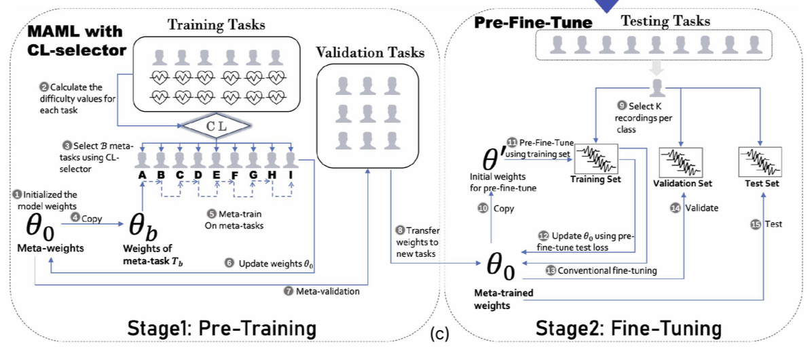

# MetaVA

## 📄 Paper Overview

This repository accompanies the paper **“A Lightweight Deep Neural Network for Personalized Detecting Ventricular Arrhythmias from a Single-Lead ECG Device”** (PLOS Digital Health, 2025). The work targets two core challenges in ECG-based VA detection: **inter-subject diversity** (differences across people) and **intra-subject diversity** (temporal changes within the same person). We introduce **MetaVA**, a lightweight, on-device-friendly pipeline that adapts to a new individual with only a handful of labeled beats.

### 🔧 Repo at a glance
- `pre_train.py` — meta-pretraining entrypoint  
- `finetune.py` — per-subject adaptation / evaluation  
- `MAML.py` — core MAML training utilities  
- `dataprocess.py`, `preprocessing.py` — data I/O & transforms  
- `tran_models.py` — model backbones (lightweight CNN–Transformer)  
- `args.py`, `util.py` — CLI + helpers  

## 🚀 Method: MetaVA in Two Stages

**Stage 1 — Meta-Pretraining (MAML + Curriculum Selector)**  
Treat each **subject as a meta-task**. We learn a **subject-agnostic initialization** with **MAML**, while a **curriculum selector (CL-selector)** schedules tasks from easy→hard to stabilize meta-optimization across heterogeneous patients. Output is the meta-weights**θ₀** .

**Stage 2 — Personalized Fine-tuning (Pre-fine-tune → Fine-tune)**  
Before standard fine-tuning on a new user, we insert a lightweight **MAML-inspired pre-fine-tuning** step that uses a “future” loss on the user’s small support set to bridge meta-training and direct adaptation—then run normal fine-tuning to specialize the model. This reduces drift due to **intra-subject** variability. 

---

## 📊 Key Results & Efficiency

- **Few-shot accuracy (K=10 beats/class)** on public test set: **ROC-AUC 0.984**, **F1 0.940**;  
  **Real-world HeartVoice cohort**: **ROC-AUC 0.965**, **F1 0.937**. 
- **Lightweight model**: **~0.596M params (~2.21MB FP32)**, **~17.4 MFLOPs** per 2s window, **~0.4–0.7 ms** single-thread CPU latency (batch=1, eval). Ideal for embedded/wearables. 

**Datasets** used include **MIT-BIH Arrhythmia (MITDB)**, **VFDB**, **CUDB**, and a **single-lead clinical HeartVoice VT cohort** .

## 🖇️ Getting Started

### Environment Set Up

- Create env: `conda create -n metava python=3.9`
- Install deps: `pip install -r requirements.txt` 

### Preprocess Data

`python preprocessing.py`

### Pre-training

Pre-train: `python pre_train.py`

### Fine-tuning

Fine-tune: `python finetune.py`

## 📚 Reference

If you use this code or ideas, please cite:
 Sun Z, Zhang W, Zhou Y, Geng S, Zhang D, Wang J, et al. (2025)
 *A lightweight deep neural network for personalized detecting ventricular arrhythmias from a single-lead ECG device.*
 **PLOS Digital Health** 4(10): e0001037. https://doi.org/10.1371/journal.pdig.0001037
